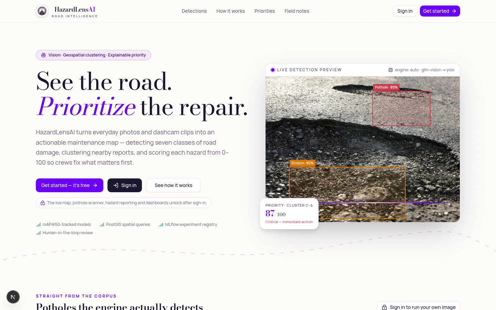
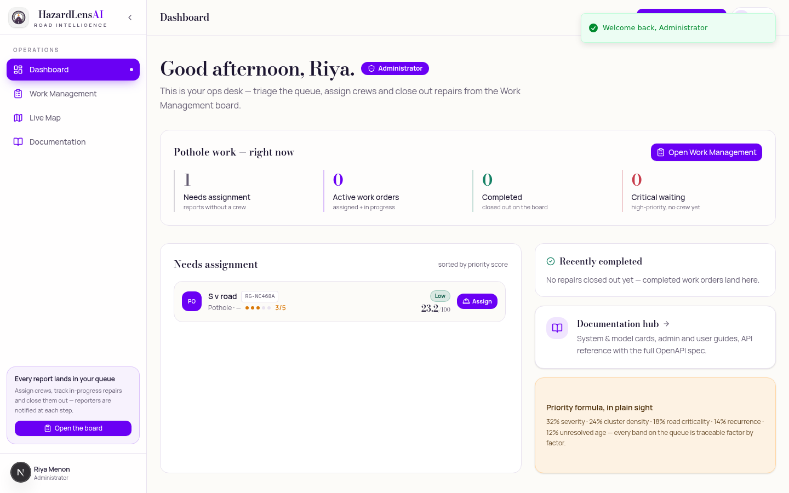
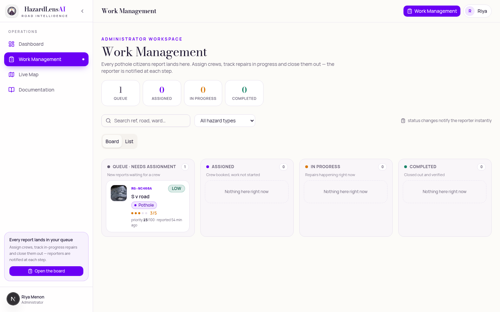
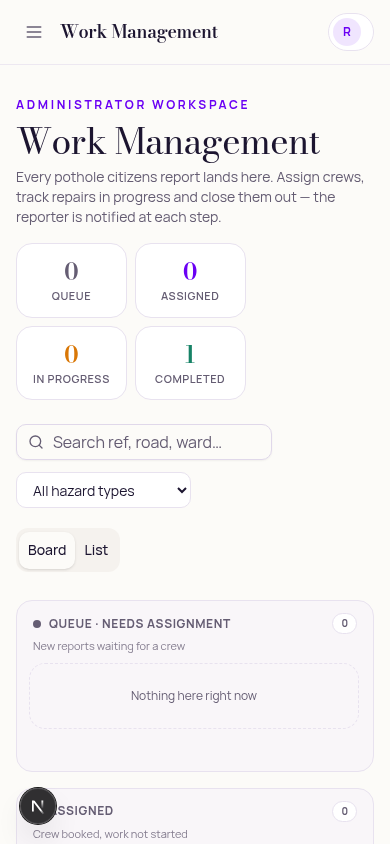

# HazardLensAI

**Road Hazard Mapping using Vision, Geospatial Clustering and Maintenance Prioritization**

> **See the road. Prioritize the repair.**

      

HazardLensAI turns citizen photos and dashcam clips into an actionable, explainable
maintenance plan for city roads. A computer-vision pipeline detects and classifies seven
road-hazard types — **pothole, crack, surface erosion, waterlogging, broken road marking,
debris, road-edge damage** — every report is geolocated, nearby reports are grouped into
clusters with **DBSCAN (60 m / 3 points / 90-day window)**, and each hazard receives an
**explainable 0–100 maintenance-priority score**. Moderators approve, correct, merge or flag
AI triage in a human-in-the-loop review queue; approved hazards flow onto a public map and a
work-order board that tracks repairs from `REPORTED` to `RESOLVED` — with an audit trail on
every decision.

```
                 ┌────────────────────────────────────────────────────────────┐
                 │                        CITIZENS                            │
                 │   photo / video + location consent + notes                 │
                 └───────────────┬────────────────────────────────────────────┘
                                 ▼
   ┌──────────────┐    ┌─────────────────────────────────────────────┐
   │ MEDIA STORE  │◀──▶│            VISION PIPELINE                  │
   │ EXIF-stripped│    │  engine chain: YOLO service (prod)          │
   │ annotated    │    │  → GLM-4.5V vision fallback → demo engine   │
   └──────────────┘    │  detections: class · confidence · bbox      │
                       └───────────────┬─────────────────────────────┘
                                       ▼
   ┌──────────────────────────────────────────────────────────────┐
   │ HUMAN REVIEW (admin command center)                          │
   │ approve · reject · flag · merge duplicates · priority        │
   │ override — every action audited                              │
   └───────────────┬──────────────────────────────────────────────┘
                   ▼
   ┌──────────────────────────┐    ┌───────────────────────────────┐
   │ GEOSPpatial CLUSTERING   │    │ PRIORITY ENGINE (0–100)       │
   │ DBSCAN over PostGIS/     │    │ 0.32·severity + 0.24·density  │
   │ Haversine, 60 m / 3 pts  │───▶│ +0.18·criticality +0.14·recur │
   └──────────────────────────┘    │ +0.12·age  → CRITICAL/HIGH/   │
                                   │ MEDIUM/LOW  · explainable API │
                                   └──────────────┬────────────────┘
                                                  ▼
                   ┌──────────────────────────────────────────────┐
                   │ PUBLIC MAP · CITIZEN DASHBOARD · WORK ORDERS │
                   │ REPORTED → UNDER REVIEW → APPROVED →         │
                   │ SCHEDULED → IN REPAIR → RESOLVED             │
                   └──────────────────────────────────────────────┘
```

## Repository layout

| Path | What it is |
|---|---|
| `src/` | **Live fullstack app** (Next.js 16 + TypeScript + Tailwind 4 + shadcn/ui): public site, interactive map, report wizard, auth, citizen dashboard, admin command center, REST API under `src/app/api/**`, engines in `src/lib/rg/**` |
| `prisma/` | Operational schema (14 entities; PostGIS parity documented in `backend/`) |
| `backend/` | **Production FastAPI + SQLAlchemy 2 + Alembic + PostgreSQL/PostGIS** reference backend (GiST-indexed geography points, Celery workers, slowapi limits, pytest) |
| `ml/` | **YOLOv8 + PyTorch + MLflow pipeline**: dataset prep/validate/split, MLflow-tracked training, evaluation (mAP@50, mAP@50-95, P/R, latency), ONNX export, FastAPI inference service with OpenCV preprocessing + privacy blur |
| `infrastructure/` | Dockerfiles (frontend/worker), deployment blueprints (Vercel/Render/Fly), rollback runbooks |
| `deploy/` | `vercel.json`, `render.yaml`, `fly.toml` |
| `docs/` | **All written deliverables** — system card, model card, admin/user guides, final report, presentation outline, demo script, API guide, contribution template |
| `scripts/seed.ts` | Bengaluru demo scenario seeder (31 hazards, 3 clusters, 6 work orders) |
| `sample-data/` | Freely-licensed road-hazard imagery (EXIF-stripped) + demo dataset generation |
| `docker-compose.yml` | Full production stack: frontend · api · worker · **postgis** · redis · ml-inference · mlflow · minio |
| `.github/workflows/` | CI (lint/typecheck/test/build/compose-validate) + tagged image deploy |
| `worklog.md` | Agent-by-agent build log (transparency) |

## Quick start — interactive demo (this deployment)

```bash
bun install
bun run db:push            # provision SQLite schema
bun run scripts/seed.ts    # Bengaluru demo scenario
bun run dev                # http://localhost:3000
```

**Demo accounts**

| Role | Email | Password |
|---|---|---|
| Administrator | `admin@roadguardatlas.dev` | `Atlas@Admin2024` |
| Citizen | `citizen@roadguardatlas.dev` | `Atlas@User2024` |

**Golden demo path (5 min):** `#/report` → upload a photo → watch the live AI detection
preview → drop the pin → submit → sign in as admin → review queue → inspect AI bounding boxes
→ approve → recompute clusters (`Map & clusters`) → watch the priority bands shift → open a
work order → walk it to *Resolved* → export CSV/GeoJSON/PDF.

## Quick start — production stack (Docker)

```bash
cp .env.example .env          # fill secrets (JWT, DB, storage…)
docker compose up --build     # api :8000 · mlflow :5000 · minio :9001 · frontend :3000
docker compose run --rm api alembic upgrade head
```

- Backend docs: `http://localhost:8000/docs` (FastAPI/OpenAPI 3.1)
- ML pipeline: `cd ml && make demo && make train EPOCHS=3 && make mlflow-ui`
- Live app OpenAPI: `/api/openapi.json` (Swagger UI embedded on the **Documentation** page)

## API surface (identical contract in both implementations)

| Group | Highlights |
|---|---|
| `/auth` | register · login · refresh (rotating) · logout · me · forgot/reset password |
| `/reports` | public submit (rate-limited 5/h/IP) · own reports · detail |
| `/hazards` | filtered feed · detail · **`{id}/review`** (approve/reject/flag/merge + edits + manual override) · **`{id}/priority-explanation`** |
| `/map`, `/clusters` | GeoJSON-ready hazards + clusters · admin recompute (eps/minPts/window/bbox) |
| `/work-orders` | board · create · status transitions with audit + notifications |
| `/analytics` | KPIs, class distribution, severity over time, wards, priority bands, confidence |
| `/uploads`, `/media/{id}` | validated uploads (magic-byte check), EXIF GPS only with consent, always stripped |
| `/inference` | engine-chain detection (image sync / video job) |
| `/admin` | overview · audit logs · settings (priority weights, clustering policy) · model registry |
| `/export` | CSV · GeoJSON (PDF client-side via jsPDF) |
| `/health`, `/metrics` | liveness · Prometheus exposition |
| `/openapi.json` | polished OpenAPI 3.1 spec |

## Documentation

Start at **[docs/README.md](docs/README.md)** — it indexes every deliverable:

[SYSTEM_CARD](docs/SYSTEM_CARD.md) · [MODEL_CARD](docs/MODEL_CARD.md) ·
[ADMIN_GUIDE](docs/ADMIN_GUIDE.md) · [USER_GUIDE](docs/USER_GUIDE.md) ·
[FINAL_REPORT](docs/FINAL_REPORT.md) · [PRESENTATION_OUTLINE](docs/PRESENTATION_OUTLINE.md) ·
[DEMO_VIDEO_SCRIPT](docs/DEMO_VIDEO_SCRIPT.md) · [API_GUIDE](docs/API_GUIDE.md) ·
[CONTRIBUTION_EVIDENCE_TEMPLATE](docs/CONTRIBUTION_EVIDENCE_TEMPLATE.md) ·
[GITHUB_SETUP](docs/GITHUB_SETUP.md) ·
[deployment guide](infrastructure/README.md) · [CONTRIBUTING](CONTRIBUTING.md) ·
[CHANGELOG](CHANGELOG.md)

## Screenshots

| Landing — live detection preview | Administrator dashboard |
|---|---|
|  |  |

| Work management board | Mobile view |
|---|---|
|  |  |

## Deployment

| Layer | Targets | Notes |
|---|---|---|
| Frontend | Vercel / Netlify | `deploy/vercel.json` |
| API + worker | Railway / Render / Fly.io / AWS | `deploy/render.yaml`, `deploy/fly.toml` |
| Database | Managed PostgreSQL **with PostGIS** (Neon / Supabase / RDS) | GiST index migrations included |
| Object storage | S3 / Cloudflare R2 / Cloudinary / MinIO | `MEDIA_BACKEND=s3` |
| MLflow | self-hosted (compose) or managed | registry ↔ admin model-versions |

Rollback strategy, migration steps and health checks: [infrastructure/README.md](infrastructure/README.md).

## Governance & stance

The priority score is a **maintenance-prioritization aid, not an engineering-grade road-safety
assessment**. AI output never auto-publishes: human review signs every decision, overrides are
audited, and the model card documents bias and failure cases in plain language. Licensed MIT —
see [LICENSE](LICENSE).
